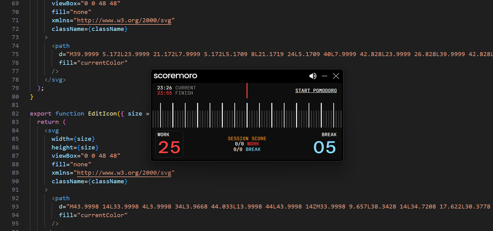

# scoremoro



A desktop pomodoro timer that runs as an always-on-top Picture-in-Picture window. Scoremoro lightly gamifies the traditional Pomodoro with a session scoreboard, rewarding completed cycles to help you stay consistent without pulling you out of flow.

## Tech Stack

- **Shell:** Electron
- **UI:** React + TypeScript
- **Build:** Vite + electron-builder
- **Lint/Format:** Biome
- **Tests:** Vitest

## Prerequisites

- Node.js 20+
- pnpm

```sh
corepack enable
corepack prepare pnpm@latest --activate
```

## Setup

```sh
git clone https://github.com/grimdyson/scoremoro.git
cd Scoremoro
pnpm install
```

## Development

```sh
pnpm dev              # Start Vite dev server (UI only)
pnpm dev:electron     # Build and launch Electron window
```

## Build

```sh
pnpm dist             # Produce release binary via electron-builder
```

## Commands

| Command | Description |
|---|---|
| `pnpm dev` | Start Vite dev server (UI only, no Electron shell) |
| `pnpm dev:electron` | Build and launch full Electron window |
| `pnpm build` | TypeScript check + Vite production build |
| `pnpm dist` | Full production build + electron-builder packaging |
| `pnpm format` | Format code (Biome) |
| `pnpm lint` | Lint code (Biome) |
| `pnpm test` | Run unit tests |

## Project Structure

```
src/
  core/       Pure logic — timer state machine, ruler math, types
  ui/         Components, styles, event bindings
  platform/   OS integration interfaces + implementations
  app/        Entry point, wiring, bootstrap
tests/
  core/       Unit tests for core logic
```

## Documentation

- [PRD.md](PRD.md) — Product requirements
- [ARCHITECTURE.md](ARCHITECTURE.md) — System design
- [DECISIONS.md](DECISIONS.md) — Decision log
- [TASKS.md](TASKS.md) — Implementation checklist
- [CONTRIBUTING.md](CONTRIBUTING.md) — How to contribute

## License

Scoremoro is source-available under the **[PolyForm Noncommercial License 1.0.0](LICENSE)**.

- You may **use, modify, and share** the code for any noncommercial purpose.
- **Commercial use or resale** requires a separate commercial license.
- [Open an issue](https://github.com/grimdyson/Scoremoro/issues) for commercial licensing inquiries.
- See [COMMERCIAL-LICENSE.md](COMMERCIAL-LICENSE.md) for full details.

This is **not** OSI-approved open source. The PolyForm Noncommercial license restricts commercial use, which means it does not meet the Open Source Definition.

## Contributing

Pull requests, bug reports, and improvements are welcome. By submitting a contribution you agree that your work will be licensed under the same PolyForm Noncommercial 1.0.0 terms as the rest of the project.

See [CONTRIBUTING.md](CONTRIBUTING.md) for branch conventions, commit style, and code standards.

## Attribution

Copyright 2026 Tim Dyson. See [NOTICE.md](NOTICE.md) for project notices.
